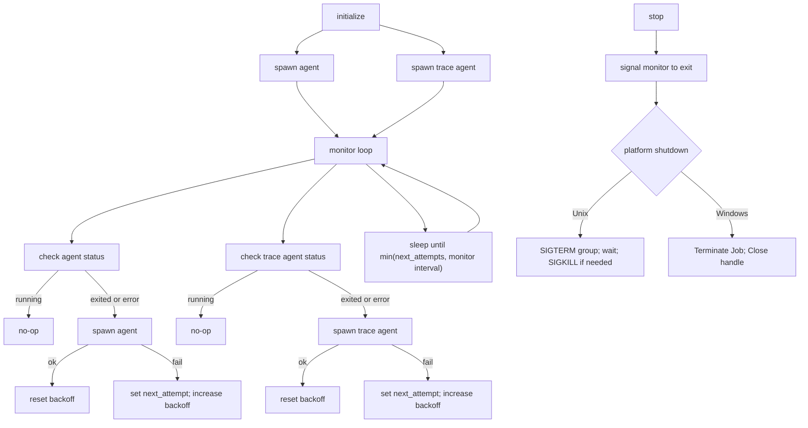

# Architecture Overview

This document explains how libagent is structured, how it manages the Agent and Trace Agent processes, and the key behaviors across platforms.

## Goals
- Start and keep Datadog Agent + Trace Agent running while the library is loaded.
- Recover from child exits with exponential backoff.
- Stop cleanly and reliably terminate process trees on unload or explicit stop.
- Provide both Rust API and stable C FFI.

## Components
- Public API: `src/lib.rs` re-exports `initialize`/`stop` and registers a destructor that calls `stop` on unload.
- Process Manager: `src/manager.rs` implements spawn, monitoring/respawn, and shutdown.
- Configuration: `src/config.rs` contains defaults and environment variable overrides (parsed with shell-words).
- FFI: `src/ffi.rs` exposes `Initialize`, `Stop`, and the transport-agnostic trace-agent proxy; see `include/libagent.h`.
- UDS HTTP client: `src/uds.rs` implements a minimal HTTP/1.1 client over Unix Domain Sockets used by the proxy.
- Windows Named Pipe client: `src/winpipe.rs` implements HTTP/1.1 over Windows Named Pipes used by the proxy.

## Lifecycle
1. Initialize: `initialize()` sets up a singleton `AgentManager` and starts both processes immediately, then launches a monitor thread.
2. Monitor: A background loop ticks at `LIBAGENT_MONITOR_INTERVAL_SECS` (default 1s), checking each child:
   - If running: no-op.
   - If exited or failed to spawn: log and schedule respawn with exponential backoff (`BACKOFF_INITIAL_SECS=1`, doubling up to `BACKOFF_MAX_SECS=30`).
   - Sleep duration adapts to the next backoff deadline so respawns aren’t delayed unnecessarily.
3. Stop: `stop()` signals the monitor thread to exit and terminates both child trees (platform-specific mechanics below). Multiple calls are safe.
4. Destructor: On library unload, the destructor calls `stop()` to ensure cleanup.

## Diagrams

Flow overview



Backoff timing (example)

```
Attempt 1: start -> fail -> next_attempt = now + 1s; backoff = 2s
Attempt 2: (≥1s) start -> fail -> next_attempt = now + 2s; backoff = 4s
Attempt 3: (≥2s) start -> ok   -> backoff reset to 1s
```

## Unix Details
- Children are placed into a new session/process group via `setsid()` in `pre_exec` so we can signal the whole tree.
- Shutdown sends `SIGTERM` to the negative PGID (process group), waits up to `GRACEFUL_SHUTDOWN_TIMEOUT_SECS` (default 5s), then escalates to `SIGKILL` if needed.
- Child stdio: inherited when debug-level logging is enabled; otherwise set to null to avoid noisy hosts.

## Windows Details
- A Job Object is created and configured with `JOB_OBJECT_LIMIT_KILL_ON_JOB_CLOSE`.
- Each child process is assigned to the Job; on stop, the Job is terminated to kill the entire tree, and the handle is closed.
- `CreateJobObjectW` is declared via an `unsafe extern "system"` block to maintain compatibility across `windows-sys` versions.
- The Windows Named Pipe HTTP client uses a reusable worker pool (4 workers by default) to handle concurrent requests efficiently under high load, with per-request timeout support (default: 50 seconds).

## Configuration
- Defaults live in `src/config.rs`:
  - Agent program/args: `datadog-agent`, empty args.
  - Trace Agent program/args: `trace-agent`, empty args (automatically configured with IPC-only settings: TCP port disabled, custom UDS/Named Pipe paths).
  - Monitor interval: 1s.
- Smart spawning logic:
  - Trace-agent: Only spawns if IPC socket/pipe is available (prevents conflicts)
  - Agent: Only spawns if remote configuration service is not available (cooperates with existing installations)
- Runtime overrides via environment variables (parsed with shell-words):
  - `LIBAGENT_AGENT_PROGRAM`, `LIBAGENT_AGENT_ARGS`
  - `LIBAGENT_TRACE_AGENT_PROGRAM`, `LIBAGENT_TRACE_AGENT_ARGS`
  - `LIBAGENT_MONITOR_INTERVAL_SECS`
  - Transport endpoints:
    - Unix UDS: `LIBAGENT_TRACE_AGENT_UDS` (default: `/tmp/datadog_libagent.socket`)
    - Windows Named Pipe: `LIBAGENT_TRACE_AGENT_PIPE` (default: `datadog-libagent`, full path `\\.\\pipe\\datadog-libagent`)
- Example: `LIBAGENT_AGENT_ARGS='-c "quoted arg"'`

## Logging
- Library log level: `LIBAGENT_LOG` set to `error|warn|info|debug`. `LIBAGENT_DEBUG=1` also forces debug level and inherits child stdout/stderr.
- By default, logs go to stderr; with the `log` feature enabled, logs route through the Rust `log` facade instead.
- Note: log level and debug checks are cached with `OnceLock`, so changes to env vars after first read do not take effect within the same process.

## Idempotency and Safety
- `initialize()` and `stop()` are idempotent.
- FFI functions catch panics with `catch_unwind` to prevent unwinding across the FFI boundary.
- Process ownership safety: Only terminates processes that libagent spawned (respects external processes).
- Resource conflict prevention: Smart spawning prevents multiple instances from competing for IPC resources.

## FFI Surface
- C API: `Initialize(void)`, `Stop(void)`, and `ProxyTraceAgent(...)` (see `include/libagent.h`).
- Rust nightly 2024 uses `#[unsafe(no_mangle)]` on FFI exports to match the current toolchain.

### Trace Agent Proxy
- Purpose: allow embedding consumers to proxy HTTP requests to the trace-agent over a local IPC transport without linking HTTP client code.
- Exported function: `int32_t ProxyTraceAgent(const char* method, const char* path, const char* headers, const uint8_t* body_ptr, size_t body_len, ResponseCallback on_response, ErrorCallback on_error, void* user_data)`.
- Path resolution:
  - Unix: UDS socket via `LIBAGENT_TRACE_AGENT_UDS` (default `/tmp/datadog_libagent.socket`).
  - Windows: Named pipe via `LIBAGENT_TRACE_AGENT_PIPE` (default `datadog-libagent`, full `\\.\\pipe\\datadog-libagent`).
- Timeout: 50 seconds for both Unix UDS and Windows Named Pipe connections.
- Request shape: headers are a single string with lines `Name: Value` separated by `\n` or `\r\n`; body is an optional byte slice.
- Response: delivered via callback with status (u16), headers (bytes), body (bytes) - no manual memory management required.
- Protocol support: HTTP/1.1 with `Content-Length` and `Transfer-Encoding: chunked` responses.
- Platform: Unix (UDS) and Windows (Named Pipes).
- Callbacks: `ResponseCallback` for success (status, headers, body), `ErrorCallback` for errors (message) - either callback is guaranteed to be called before the function returns.

## Testing Strategy
- Integration tests under `tests/` use temporary stub scripts to simulate child behavior.
- `serial_test` isolates global state; environment mutations are marked `unsafe` due to Rust 2024 nightly constraints.
- Smart spawning logic is validated through respawn tests (ensures agents spawn when resources are available).
- Cross‑platform coverage:
  - Unix: start/stop lifecycle and respawn/backoff behavior.
  - Unix: UDS proxy (basic + chunked) in `tests/uds_proxy.rs` (skips under sandboxed environments which deny UDS binds).
  - Windows: sanity check that Job-based shutdown works in `tests/windows_sanity.rs`.
  - Windows: Named Pipe proxy (basic + chunked) in `tests/windows_pipe_proxy.rs`.

## When to Update This Doc
- Changing process lifecycle or shutdown semantics in `src/manager.rs`.
- Adding/removing environment variables or defaults in `src/config.rs`.
- Modifying the FFI surface or header generation.
