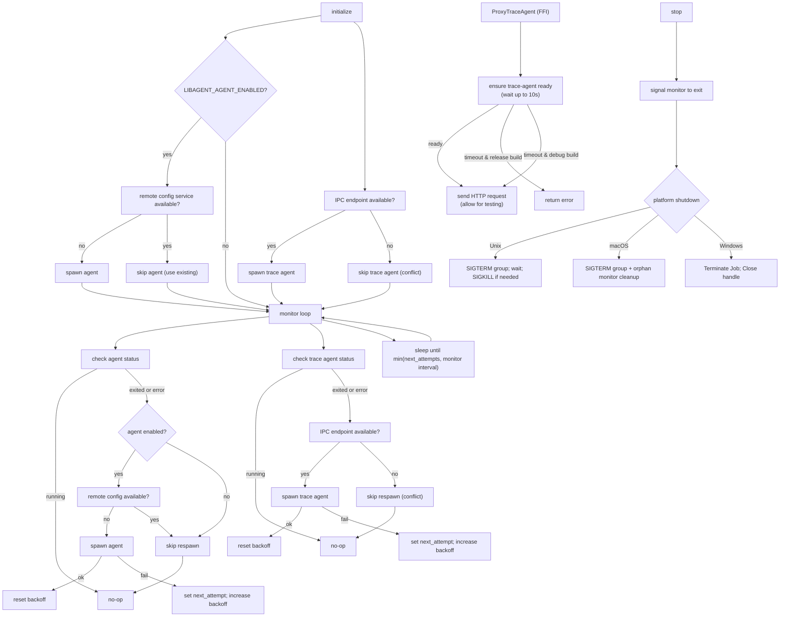

# Architecture Overview

This document explains how libagent is structured, how it manages the Agent and Trace Agent processes, and the key behaviors across platforms.

## Goals
- Start and keep Datadog Agent + Trace Agent running while the library is loaded.
- Implement smart spawning logic to avoid conflicts with existing Datadog installations.
- Ensure IPC endpoint consistency across spawning, monitoring, readiness checks, and proxy requests.
- Recover from child exits with exponential backoff.
- Stop cleanly and reliably terminate process trees on unload or explicit stop.
- Provide both Rust API and stable C FFI.

## Components
- Public API: `src/lib.rs` re-exports `initialize`/`stop` and registers a destructor that calls `stop` on unload.
- Process Manager: `src/manager.rs` orchestrates overall agent management, coordinating between logging, process spawning, monitoring, and shutdown.
- Logging: `src/logging.rs` provides centralized logging functionality with environment variable parsing for log level and debug mode.
- Process Spawning: `src/process.rs` handles platform-specific process spawning logic including `setsid()` on Unix and Job Objects on Windows, and applies the configured IPC overrides (`LIBAGENT_TRACE_AGENT_UDS` / `LIBAGENT_TRACE_AGENT_PIPE`) when preparing the child environment.
- Shutdown: `src/shutdown.rs` implements platform-specific process termination with graceful escalation strategies.
- Monitor: `src/monitor.rs` implements the background monitoring thread with respawn logic, exponential backoff, and IPC resource conflict detection, reusing the configured IPC endpoint to decide whether it is safe to spawn.
- Metrics: `src/metrics.rs` provides observability metrics tracking for process lifecycle and HTTP proxy statistics.
- Configuration: `src/config.rs` contains defaults and environment variable overrides (parsed with shell-words).
- FFI: `src/ffi.rs` exposes `Initialize`, `Stop`, `GetMetrics`, and the transport-agnostic trace-agent proxy; see `include/libagent.h`.
- UDS HTTP client: `src/uds.rs` implements a minimal HTTP/1.1 client over Unix Domain Sockets used by the proxy.
- Windows Named Pipe client: `src/winpipe.rs` implements HTTP/1.1 over Windows Named Pipes using overlapped I/O with explicit cancellation to honour per-request timeouts.

## Lifecycle
1. Initialize: `initialize()` sets up a singleton `AgentManager` in a global cell. The global lock is held through the initial `start()` so concurrent callers all share the same manager instance, then the monitor thread is launched.
2. Smart Spawning: Before spawning processes, checks are performed:
   - Trace Agent: Only spawns if IPC endpoint (UDS socket/Named Pipe) is available (no conflicts with existing processes).
   - Agent: Only spawns if enabled AND no existing remote configuration service is detected on `localhost:5001`.
3. Monitor: A background loop ticks at `LIBAGENT_MONITOR_INTERVAL_SECS` (default 1s), checking each child:
   - If running: no-op.
   - If exited or failed to spawn: re-applies smart spawning logic before attempting respawn, then schedules respawn with exponential backoff (`BACKOFF_INITIAL_SECS=1`, doubling up to `BACKOFF_MAX_SECS=30`).
   - Sleep duration adapts to the next backoff deadline so respawns aren't delayed unnecessarily.
4. Stop: `stop()` signals the monitor thread to exit and terminates both child trees (platform-specific mechanics below). Multiple calls are safe.
5. Destructor: On library unload, the destructor calls `stop()` to ensure cleanup.

## Diagrams

Flow overview



Backoff timing (example)

```
Attempt 1: start -> fail -> next_attempt = now + 1s; backoff = 2s
Attempt 2: (≥1s) start -> fail -> next_attempt = now + 2s; backoff = 4s
Attempt 3: (≥2s) start -> ok   -> backoff reset to 1s
```

## Unix Details
- Children are placed into a new session/process group via `setsid()` in `pre_exec` so we can signal the whole tree.
- Shutdown sends `SIGTERM` to the negative PGID (process group), waits up to `GRACEFUL_SHUTDOWN_TIMEOUT_SECS` (default 5s), then escalates to `SIGKILL` if needed.
- Child stdio: inherited when debug-level logging is enabled; otherwise set to null to avoid noisy hosts.
- **macOS/BSD only**: An orphan cleanup monitor process is forked at startup to watch the parent PID and terminate children if the parent dies unexpectedly.

## Windows Details
- A Job Object is created and configured with `JOB_OBJECT_LIMIT_KILL_ON_JOB_CLOSE`.
- Each child process is assigned to the Job; on stop, the Job is terminated to kill the entire tree, and the handle is closed.
- `CreateJobObjectW` is declared via an `unsafe extern "system"` block to maintain compatibility across `windows-sys` versions.
- The Windows Named Pipe HTTP client uses a reusable worker pool (4 workers by default) to handle concurrent requests efficiently under high load, with per-request timeout support (default: 50 seconds).

## Configuration
- Defaults live in `src/config.rs`:
  - Agent program/args: `datadog-agent`, empty args.
  - Trace Agent program/args: `trace-agent`, empty args (automatically configured with IPC-only settings: TCP port disabled, custom UDS/Named Pipe paths).
  - Monitor interval: 1s.
- Smart spawning logic:
  - Trace-agent: Only spawns if IPC socket/pipe is available (prevents conflicts)
  - Agent: Only spawns if agent is enabled AND no existing agent provides remote configuration (supports custom trace-agents by default)
- Runtime overrides via environment variables (parsed with shell-words):
  - `LIBAGENT_AGENT_PROGRAM`, `LIBAGENT_AGENT_ARGS`
  - `LIBAGENT_TRACE_AGENT_PROGRAM`, `LIBAGENT_TRACE_AGENT_ARGS`
  - `LIBAGENT_MONITOR_INTERVAL_SECS`
  - `LIBAGENT_AGENT_ENABLED` (enable main agent; disabled by default for custom trace-agents)
  - Transport endpoints:
    - Unix UDS: `LIBAGENT_TRACE_AGENT_UDS` (default: `/tmp/datadog_libagent.socket`)
    - Windows Named Pipe: `LIBAGENT_TRACE_AGENT_PIPE` (default: `datadog-libagent`, full path `\\.\\pipe\\datadog-libagent`)
- IPC overrides are consumed everywhere the endpoint matters: spawning config, readiness checks, monitor conflict detection, and the FFI proxy all read the same value to avoid drift.
- Example: `LIBAGENT_AGENT_ARGS='-c "quoted arg"'`

## Logging
- **Format**: `2025-09-26T14:44:51.408Z [libagent] [LEVEL] message`
- **Timestamps**: ISO 8601 format with millisecond precision (UTC)
- **Levels**: `[ERROR]`, `[WARN]`, `[INFO]`, `[DEBUG]`
- Library log level: `LIBAGENT_LOG` set to `error|warn|info|debug`. `LIBAGENT_DEBUG=1` also forces debug level and inherits child stdout/stderr.
- By default, logs go to stderr; with the `log` feature enabled, logs route through the Rust `log` facade instead.
- Note: log level and debug checks are cached with `OnceLock`, so changes to env vars after first read do not take effect within the same process.

## Process Lifecycle & Orphaned Process Handling

### Normal Operation
1. `initialize()` spawns processes and starts monitoring
2. `stop()` terminates all child processes and stops monitoring
3. Destructor (`#[ctor::dtor]`) calls `stop()` on library unload

### Process Group Management (Unix)
- Children are created with `setsid()` to establish new process groups for isolation
- Parent death signals (`PR_SET_PDEATHSIG`) ensure children die immediately if parent dies
- Shutdown sends signals to entire process groups (`kill(-pgid, SIGTERM)`)
- This ensures all child processes and their descendants are terminated

### Job Object Management (Windows)
- All child processes are assigned to a Windows Job Object
- Job is configured with `JOB_OBJECT_LIMIT_KILL_ON_JOB_CLOSE`
- When the Job handle is closed (during shutdown), all processes in the job are terminated

### Orphaned Process Scenarios
If the parent application is killed forcefully (SIGKILL, crash, etc.):

**Linux:**
- Parent death signals (`PR_SET_PDEATHSIG`) ensure child processes are terminated immediately
- No orphaned processes - children die as soon as they detect parent death
- Process group isolation prevents runaway process trees during normal operation

**macOS/BSD:**
- Dedicated monitor process forked at startup to watch parent PID
- Monitor process survives parent death and terminates Datadog children
- Provides immediate cleanup when parent dies (unlike reparenting detection)

**Windows:**
- Job Objects ensure all processes are terminated when the job handle is closed
- Even if the parent crashes, Windows will terminate all job processes
- No orphaned processes on Windows

### Best Practices
- Call `libagent::stop()` during application shutdown
- Handle signals gracefully in your application
- On Unix, avoid sending SIGKILL to your application - use SIGTERM for clean shutdown

## Idempotency and Safety
- `initialize()` and `stop()` are idempotent; `initialize()` is safe to invoke concurrently and only the first caller will perform the actual startup work.
- FFI functions catch panics with `catch_unwind` to prevent unwinding across the FFI boundary.
- Process ownership safety: Only terminates processes that libagent spawned (respects external processes).
- Resource conflict prevention: Smart spawning prevents multiple instances from competing for IPC resources.

## FFI Surface
- C API: `Initialize(void)`, `Stop(void)`, `GetMetrics()`, and `ProxyTraceAgent(...)` (see `include/libagent.h`).
- `GetMetrics()` returns a `MetricsData` struct with comprehensive metrics (process lifecycle, HTTP proxy stats, response times).
- Rust nightly 2024 uses `#[unsafe(no_mangle)]` on FFI exports to match the current toolchain.

### Trace Agent Proxy
- Purpose: allow embedding consumers to proxy HTTP requests to the trace-agent over a local IPC transport without linking HTTP client code.
- Exported function: `int32_t ProxyTraceAgent(const char* method, const char* path, const char* headers, const uint8_t* body_ptr, size_t body_len, ResponseCallback on_response, ErrorCallback on_error, void* user_data)`.
- Path resolution:
  - Unix: UDS socket via `LIBAGENT_TRACE_AGENT_UDS` (default `/tmp/datadog_libagent.socket`).
  - Windows: Named pipe via `LIBAGENT_TRACE_AGENT_PIPE` (default `datadog-libagent`, full `\\.\\pipe\\datadog-libagent`).
- Timeout enforcement: Unix uses socket timeouts; Windows uses overlapped I/O with `CancelIoEx` to abort stalled operations.
- These values are shared with the spawner and monitor, guaranteeing proxy requests target the same IPC endpoint that the managed trace-agent instance uses.
- Timeout: 50 seconds for both Unix UDS and Windows Named Pipe connections.
- Request shape: headers are a single string with lines `Name: Value` separated by `\n` or `\r\n`; body is an optional byte slice.
- Response: delivered via callback with status (u16), headers (bytes), body (bytes) - no manual memory management required.
- Protocol support: HTTP/1.1 with `Content-Length` and `Transfer-Encoding: chunked` responses.
- Readiness check: Before sending requests, waits up to 10 seconds (500ms in debug builds) for the trace-agent to be ready to accept connections. In release builds, returns an error if the trace-agent doesn't become ready within the timeout. In debug builds, proceeds anyway to facilitate testing.
- Platform: Unix (UDS) and Windows (Named Pipes).
- Callbacks: `ResponseCallback` for success (status, headers, body), `ErrorCallback` for errors (message) - either callback is guaranteed to be called before the function returns.

## Testing Strategy
- Integration tests under `tests/` use temporary stub scripts to simulate child behavior.
- `serial_test` isolates global state; environment mutations are marked `unsafe` due to Rust 2024 nightly constraints.
- Smart spawning logic is validated through respawn tests (ensures agents spawn when resources are available).
- Cross‑platform coverage:
  - Unix: start/stop lifecycle and respawn/backoff behavior.
  - Unix: UDS proxy (basic + chunked) in `tests/uds_proxy.rs` (skips under sandboxed environments which deny UDS binds).
  - Windows: sanity check that Job-based shutdown works in `tests/windows_sanity.rs`.
  - Windows: Named Pipe proxy (basic + chunked) in `tests/windows_pipe_proxy.rs`.

## When to Update This Doc
- Changing process lifecycle, spawning, shutdown, monitoring, or logging semantics across `src/manager.rs`, `src/process.rs`, `src/shutdown.rs`, `src/monitor.rs`, or `src/logging.rs`.
- Modifying smart spawning logic, IPC endpoint consistency, or conflict detection behavior.
- Adding/removing environment variables or defaults in `src/config.rs`.
- Modifying the FFI surface, metrics tracking, or header generation.
- Changing trace-agent readiness checks or proxy behavior.
